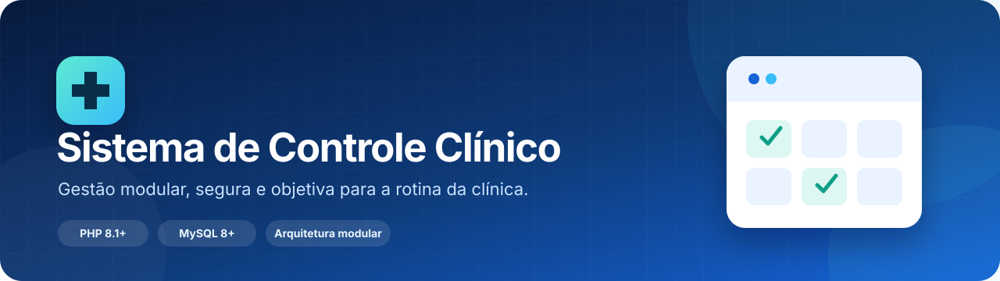
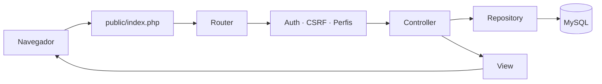

<p align="center">
  
</p>

<h1 align="center">Sistema de Controle Clínico</h1>

<p align="center">
  Uma aplicação web modular para organizar médicos, pacientes, consultas e a agenda operacional de uma clínica.
</p>

<p align="center">
  
  
  
  
</p>

<p align="center">
  <a href="#visão-geral">Visão geral</a> ·
  <a href="#funcionalidades">Funcionalidades</a> ·
  <a href="#arquitetura">Arquitetura</a> ·
  <a href="#início-rápido">Início rápido</a> ·
  <a href="#segurança">Segurança</a> ·
  <a href="#documentação">Documentação</a>
</p>

---

## Visão geral

O **Sistema de Controle Clínico (SCC)** centraliza a rotina administrativa de uma clínica pequena em uma interface única. A aplicação cobre o cadastro das pessoas envolvidas, evita choques básicos de agenda e oferece visões operacionais para o dia, mês e período selecionado.

> **Objetivo:** substituir controles dispersos por um fluxo simples, rastreável e preparado para evoluir — sem esconder a regra de negócio dentro de páginas PHP isoladas.

<table>
  <tr>
    <td width="33%" valign="top">
      <h3>🩺 Operação centralizada</h3>
      Médicos, pacientes, consultas e agenda compartilham o mesmo fluxo autenticado.
    </td>
    <td width="33%" valign="top">
      <h3>🧩 Código modular</h3>
      Controllers, repositories e views possuem responsabilidades claras por domínio.
    </td>
    <td width="33%" valign="top">
      <h3>🛡️ Segurança por padrão</h3>
      Prepared statements, CSRF, escape de saída, sessão protegida e perfis de acesso.
    </td>
  </tr>
</table>

## Funcionalidades

<table>
  <tr>
    <td width="50%" valign="top">
      <h3>🔐 Acesso</h3>
      <ul>
        <li>login com <code>password_hash</code> e <code>password_verify</code>;</li>
        <li>limitação básica de tentativas;</li>
        <li>perfis <code>administrador</code> e <code>atendente</code>;</li>
        <li>logout por POST com token CSRF.</li>
      </ul>
    </td>
    <td width="50%" valign="top">
      <h3>📊 Dashboard</h3>
      <ul>
        <li>total de médicos e pacientes;</li>
        <li>consultas do dia e futuras;</li>
        <li>atalhos para as áreas principais;</li>
        <li>lista dos próximos atendimentos.</li>
      </ul>
    </td>
  </tr>
  <tr>
    <td width="50%" valign="top">
      <h3>👥 Cadastros</h3>
      <ul>
        <li>gestão de médicos e especialidades;</li>
        <li>pacientes com validação de CPF;</li>
        <li>CPF mascarado nas listagens;</li>
        <li>exclusão segura de registros vinculados.</li>
      </ul>
    </td>
    <td width="50%" valign="top">
      <h3>📅 Agenda</h3>
      <ul>
        <li>conflito bloqueado por médico e paciente;</li>
        <li>agenda diária;</li>
        <li>calendário mensal com volume por dia;</li>
        <li>relatório por período e profissional.</li>
      </ul>
    </td>
  </tr>
</table>

## Stack

<p align="center">
  <strong>PHP 8.1+</strong> &nbsp;→&nbsp;
  <strong>MySQLi</strong> &nbsp;→&nbsp;
  <strong>MySQL 8+</strong> &nbsp;·&nbsp;
  <strong>HTML5</strong> &nbsp;·&nbsp;
  <strong>CSS3</strong> &nbsp;·&nbsp;
  <strong>JavaScript</strong> &nbsp;·&nbsp;
  <strong>Bootstrap 5.3.3</strong>
</p>

| Camada | Implementação | Responsabilidade |
| :--- | :--- | :--- |
| Entrada HTTP | Front Controller + Router | Resolver rota, método, sessão, perfil e CSRF |
| Aplicação | Controllers por módulo | Normalizar entrada e coordenar o caso de uso |
| Persistência | Repositories + MySQLi | Executar SQL exclusivamente parametrizado |
| Apresentação | Views + layouts | Renderizar HTML com escape contextual |
| Dados | MySQL / MariaDB | Garantir relações, unicidade e conflitos de agenda |

## Arquitetura



A aplicação segue um **monólito modular**: simples para publicar, mas com fronteiras internas claras. Todo acesso web começa em `public/index.php`; código, configuração, schema e logs permanecem fora do *document root*.

<details>
<summary><strong>Ver estrutura de diretórios</strong></summary>

```text
.
├── app/
│   ├── Config/              # configuração por ambiente
│   ├── Core/                # router, banco, sessão, auth, CSRF e views
│   ├── Modules/
│   │   ├── Agenda/
│   │   ├── Auth/
│   │   ├── Consultas/
│   │   ├── Dashboard/
│   │   ├── Medicos/
│   │   └── Pacientes/
│   ├── Shared/Views/        # layouts, alertas e erros
│   ├── bootstrap.php        # bootstrap único
│   └── routes.php           # tabela central de rotas
├── bin/                     # comandos administrativos
├── database/                # schema versionado
├── docs/                    # documentação técnica
├── public/                  # única pasta exposta pelo servidor
└── storage/logs/            # logs locais ignorados pelo Git
```

</details>

[Leia a documentação completa da arquitetura →](docs/ARCHITECTURE.md)

## Início rápido

### Pré-requisitos

- PHP **8.1+** com `mysqli` e `mysqlnd`;
- MySQL **8+** ou MariaDB compatível;
- PowerShell para os comandos abaixo;
- Composer é opcional.

### 1. Clone e configure

```powershell
git clone https://github.com/ObarbosaDev/Sistema-de-Clinicas.git
Set-Location Sistema-de-Clinicas
Copy-Item .env.example .env
```

Edite `.env` com as credenciais locais. Esse arquivo nunca deve entrar no Git.

### 2. Prepare o banco

```powershell
mysql -u root -p -e "CREATE DATABASE clinica CHARACTER SET utf8mb4 COLLATE utf8mb4_unicode_ci"
Get-Content -Raw database/schema.sql | mysql -u root -p clinica
```

Crie uma conta de banco exclusiva para a aplicação:

```sql
CREATE USER 'clinica_app'@'localhost' IDENTIFIED BY 'troque-por-uma-senha-forte';
GRANT SELECT, INSERT, UPDATE, DELETE ON clinica.* TO 'clinica_app'@'localhost';
FLUSH PRIVILEGES;
```

> Não execute a aplicação com o usuário `root` do MySQL.

### 3. Crie o administrador

```powershell
$secure = Read-Host "Senha inicial" -AsSecureString
$env:CLINICA_USER_PASSWORD = [Net.NetworkCredential]::new('', $secure).Password
php bin/criar-usuario.php --nome="Administrador" --email="admin@clinica.local" --perfil=administrador
Remove-Item Env:CLINICA_USER_PASSWORD
```

A senha precisa ter pelo menos **12 caracteres** e não é gravada no histórico do terminal.

### 4. Inicie a aplicação

```powershell
php -S localhost:8000 -t public
```

Acesse **http://localhost:8000**.

> Em produção, aponte Apache, Nginx ou IIS exclusivamente para `public/`. A raiz do repositório nunca deve ser publicada.

## Configuração

<details>
<summary><strong>Ver variáveis de ambiente disponíveis</strong></summary>

| Variável | Padrão | Uso |
| :--- | :--- | :--- |
| `APP_NAME` | `Sistema de Controle Clínico` | Nome exibido pela aplicação |
| `APP_ENV` | `production` | Ambiente atual |
| `APP_DEBUG` | `false` | Detalhes de erro; apenas localmente |
| `APP_TIMEZONE` | `America/Sao_Paulo` | Fuso da operação |
| `DB_HOST` | `localhost` | Host do MySQL |
| `DB_PORT` | `3306` | Porta do MySQL |
| `DB_DATABASE` | `clinica` | Banco da aplicação |
| `DB_USERNAME` | `clinica_app` | Usuário com menor privilégio |
| `DB_PASSWORD` | — | Senha do banco |
| `SESSION_NAME` | `clinica_session` | Nome do cookie de sessão |
| `SESSION_SECURE` | `false` | Defina `true` sob HTTPS |
| `SESSION_SAME_SITE` | `Lax` | Política SameSite |

</details>

## Segurança

A aplicação adota controles básicos desde a entrada até o banco:

- ✅ SQL exclusivamente com **prepared statements**;
- ✅ escape contextual de toda saída dinâmica;
- ✅ token **CSRF** em todas as mutações;
- ✅ escrita e logout somente por **POST**;
- ✅ regeneração e remoção segura da sessão;
- ✅ cookie `HttpOnly` e `SameSite`;
- ✅ exclusões restritas ao perfil `administrador`;
- ✅ constraints contra conflito concorrente de agenda;
- ✅ cabeçalhos HTTP defensivos e logs fora da pasta pública.

> [!IMPORTANT]
> Dados clínicos são sensíveis. Para produção, complemente a aplicação com HTTPS obrigatório, backups cifrados, auditoria de acesso, política de retenção e controles organizacionais compatíveis com a LGPD.

[Consulte a política de segurança →](SECURITY.md)

## Documentação

| Documento | Conteúdo |
| :--- | :--- |
| [`README.md`](README.md) | Visão do produto, instalação e operação |
| [`docs/ARCHITECTURE.md`](docs/ARCHITECTURE.md) | Componentes, fluxo e decisões técnicas |
| [`CONTRIBUTING.md`](CONTRIBUTING.md) | Branches, padrão de código e commits |
| [`SECURITY.md`](SECURITY.md) | Reporte responsável e dados sensíveis |
| [`database/schema.sql`](database/schema.sql) | Baseline do banco de dados |

## Desenvolvimento

O projeto usa tipos estritos, namespace `Clinica\\` e autoload interno. Composer pode gerar um autoloader otimizado, mas não é obrigatório:

```powershell
composer dump-autoload
```

Commits seguem **Conventional Commits em português**:

```text
feat: adiciona filtro por médico
fix: corrige conflito de horário
refactor: separa módulo de pacientes
docs: melhora instruções de instalação
chore: organiza arquivos públicos
revert: restaura fluxo de autenticação
```

[Veja o guia de contribuição →](CONTRIBUTING.md)

## Evolução

| Estado | Entrega |
| :---: | :--- |
| ✅ | Autenticação, perfis e sessão segura |
| ✅ | Médicos, pacientes e consultas |
| ✅ | Agenda diária, calendário e relatório |
| ✅ | Arquitetura modular e configuração por ambiente |
| 🟡 | Paginação e busca avançada |
| 🟡 | Auditoria imutável de operações |
| 🟡 | Testes automatizados e CI |
| ⚪ | Prontuário, notificações e múltiplas unidades |

## Licença

Nenhuma licença de uso foi definida. Consulte o proprietário antes de redistribuir ou utilizar comercialmente.

---

<p align="center">
  Feito para transformar uma agenda simples em uma base clínica organizada, segura e evolutiva.
</p>
