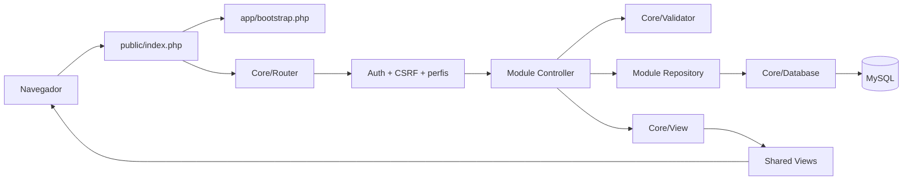

# Arquitetura

## Objetivo

A arquitetura separa transporte HTTP, regras de aplicação, persistência e apresentação sem introduzir um framework. O desenho reduz dependências implícitas, permite evolução por domínio e mantém a aplicação simples para execução em hospedagens PHP tradicionais.

## Visão de componentes



## Camadas

### `public/`

Única superfície HTTP. Contém o front controller e assets estáticos. Nenhum arquivo com credenciais, SQL ou regra de negócio deve ser servido diretamente.

### `app/Core/`

Infraestrutura transversal:

- `Database`: conexão única, UTF-8 e execução parametrizada;
- `Router`: contrato de métodos, autenticação, perfis e CSRF;
- `Session` e `Auth`: ciclo de sessão e identidade atual;
- `Validator`: validações determinísticas de entrada;
- `View`: resolução de templates internos;
- `ErrorHandler`: resposta segura e log local;
- `Env`: configuração sem dependência externa.

### `app/Modules/`

Cada domínio mantém seu controller, repository e views:

- o **controller** converte a requisição em uma ação, valida e decide o redirecionamento;
- o **repository** é o único componente do módulo que conhece SQL;
- a **view** apresenta dados recebidos, sempre escapados.

Módulos não incluem arquivos de configuração e não acessam conexão global. Dependências compartilhadas chegam pelo namespace `Clinica\\Core`.

### `app/Shared/Views/`

Layouts e componentes comuns. O layout autenticado oferece navegação e logout por POST; o layout de visitante é usado pelo login.

### `database/`

`schema.sql` representa a baseline para uma instalação nova. Mudanças posteriores de produção devem ser adicionadas como migrações incrementais, nunca alterando silenciosamente uma base existente.

## Fluxo de uma requisição

1. `public/index.php` carrega o bootstrap e os cabeçalhos defensivos.
2. O roteador resolve `route` e método HTTP.
3. O roteador aplica autenticação, perfil e CSRF antes do controller.
4. O controller normaliza e valida a entrada.
5. O repository executa prepared statements.
6. O controller renderiza uma view ou responde com redirect `303`.
7. Exceções são registradas em `storage/logs/app.log` e recebem resposta sem detalhes em produção.

## Decisões de segurança

- **Document root isolado:** bloqueia acesso direto a módulos, schema e configuração.
- **Prepared statements obrigatórios:** valores nunca alteram a estrutura do SQL.
- **Escape na saída:** mantém o dado original e neutraliza XSS no contexto HTML.
- **CSRF central:** toda requisição POST é validada pelo roteador.
- **Métodos explícitos:** leitura usa GET; criação, edição, exclusão e logout usam POST.
- **Sessão regenerada:** o identificador muda no login e o cookie é removido no logout.
- **Perfis:** exclusões exigem `administrador`.
- **Constraints de agenda:** banco e aplicação impedem conflitos concorrentes.

## Regras de dependência

```text
View -> helpers de apresentação
Controller -> Core + Repository + View
Repository -> Database
Core -> PHP/extensões
```

Repositories não renderizam; views não consultam banco; controllers não concatenam SQL. Novos domínios devem repetir esse limite, não copiar o antigo padrão de páginas autônomas.

## Evolução recomendada

Quando o sistema crescer, as próximas fronteiras naturais são: container de dependências, migrações versionadas, paginação, serviços de domínio para intervalos de agenda, política de autorização por capacidade, testes automatizados e trilha de auditoria append-only.
